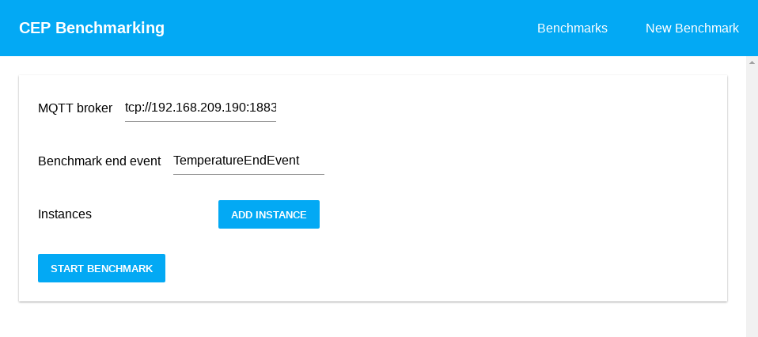

# User Guide

## Benchmarking platform

### Home page



Here the user can set the CEP engine benchmarking configuration and submit the form once it's done.

- `MQQT broker` ip address of the MQQT broker to be used during benchmark.
- `EndEventName` topic to be subscribed by the benchmarking instances that signals the end of the benchmark.
- `Instances` benchmarking instance configuration, add new instances and configure them individually, once a new instances is added, you can choose which CEP engine to use.
- `Start Benchmark` submit the form and start the benchmark.

#### Esper engine


- `Events` here are defined the input events for the benchmark, each event has a name (the MQQT topic the events are going to be published to) and a set of properties.
  - `Properties` each event property is a key-value pair, consisting of name and data type.
- `Statements` here are defined the output statements, each statement has a name and an EPL query definition.


#### Siddhi engine


The Siddhi engine configuration is similar to the Esper configuration, with a few exceptions.

- `Definition` everything is defined here: the input streams, the queries and the outputs. This is done via the Siddhi query language.
- `Events` and `Queries` the names for events and queries used in the `Definition` field need to be filled individually here, if this is not done, the benchmarking instance will not function properly.

### Benchmarks

Here the user can visualize ongoing and past benchmarks, as well as each instance and its output events.

## How events should be structured

Every event sent to the MQQT broker is expected to be in a JSON object format.

The event object's fields must match the event properties previously defined in the benchmarking configuration.

E.g. the user defines an event `WeatherEvent` with the properties `temperature` and `humidity`, of types `float` and `int` respectively. The events sent to the MQQT broker topic `WeatherEvent` must have the following JSON format:

```json
{
  "temperature": 24.3,
  "humidity": 30
}
```

**Note**: the only allowed types allowed are `string`, `number` and `boolean`, an event property cannot be of type `object`, `array` or `null`.
